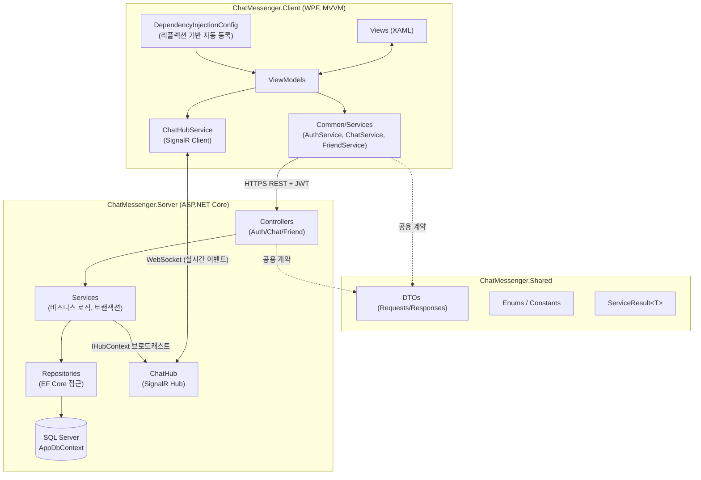
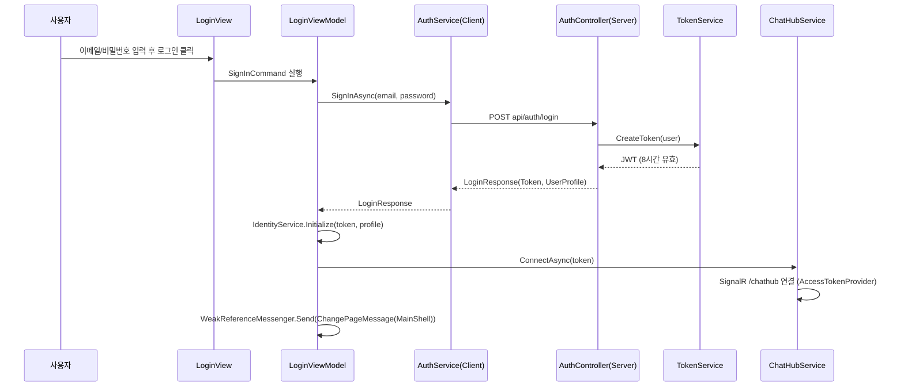
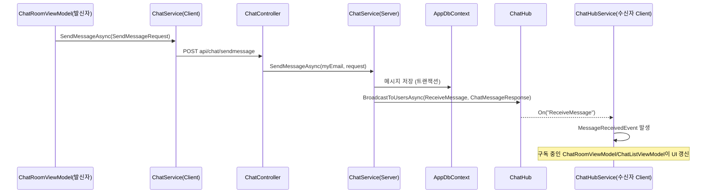
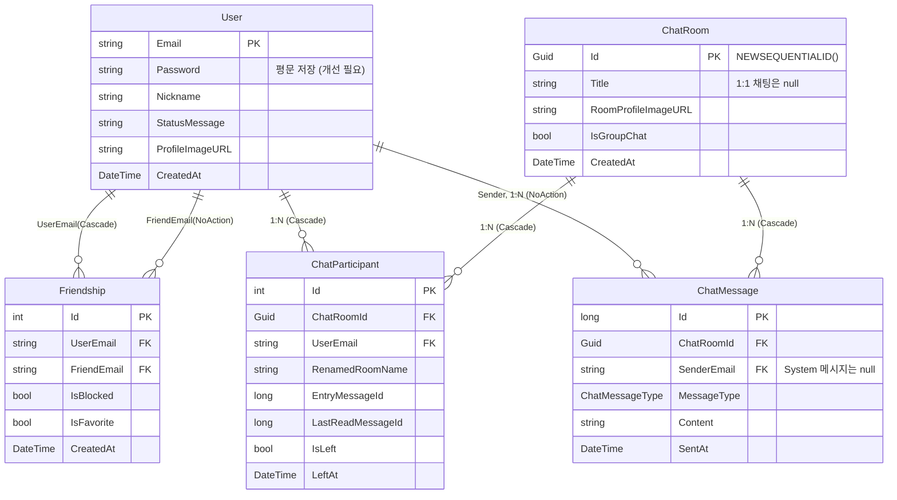

# ChatMessenger 프로젝트 계획서

> 본 문서는 WPF 클라이언트(`ChatMessenger.Client`) + ASP.NET Core 서버(`ChatMessenger.Server`) + 공용 계약(`ChatMessenger.Shared`)으로 구성된 실시간 채팅 메신저의 청사진입니다. 2026-07-14 기준 저장소 코드를 실제로 열람하여 작성되었습니다.

## 목차
* [1-1. 요구사항 및 목표 정의](#1-1-요구사항-및-목표-정의)
* [1-2. 비기능적 요구사항](#1-2-비기능적-요구사항)
* [1-3. 시스템 아키텍처 설계](#1-3-시스템-아키텍처-설계)
* [1-4. UI 화면 및 MVVM 매핑 명세](#1-4-ui-화면-및-mvvm-매핑-명세)
* [1-5. 컴포넌트 간 통신 및 메시징 규약](#1-5-컴포넌트-간-통신-및-메시징-규약)
* [1-6. 인터페이스 및 메서드 명세서](#1-6-인터페이스-및-메서드-명세서)
* [1-7. 데이터베이스 및 모델 구조](#1-7-데이터베이스-및-모델-구조)

---

## 1-1. 요구사항 및 목표 정의

### 프로젝트 목적
포트폴리오용으로 제작되는 데스크톱 실시간 채팅 메신저로, WPF(MVVM) 클라이언트와 ASP.NET Core 백엔드가 REST API + SignalR을 통해 통신하는 **클라이언트-서버 아키텍처**를 완성하는 것이 목표입니다. (`README.md`)

### 핵심 기능 (저장소 코드에서 실제 구현 확인)
| 영역 | 기능 |
|---|---|
| 인증 | 회원가입(`RegisterView`), 로그인(`LoginView`), JWT 토큰 기반 세션 유지 |
| 친구 | 친구 검색, 친구 추가/삭제, 즐겨찾기 등록/해제, 차단/차단해제, 친구 목록/상세 조회 |
| 채팅방 | 1:1 채팅방 생성(또는 기존 방 재사용), 그룹 채팅방 생성, 참가자 초대, 채팅방 목록 조회, 채팅방 나가기 |
| 메시징 | 메시지 전송/수신(SignalR 실시간 브로드캐스트), 최근 50개 메시지 조회, 읽음 상태(LastReadMessageId) 동기화, 입장/퇴장 시스템 메시지 자동 생성 |
| 세션 관리 | 강제 로그아웃(비정상 세션 감지 시), SignalR 재연결(`WithAutomaticReconnect`) |
| 설정 | `SettingListView`/`SettingDetailView` — **플레이스홀더 수준**(미구현, 1-4 항목 참고) |

### 미완성/제약 사항 (코드에서 확인된 TODO)
* `ChatRoomViewModel.cs:139` — 채팅방 나가기 시 확인 다이얼로그 없이 즉시 실행됨(TODO 주석 존재)
* `WindowViewModelBase.cs:43` — 창 닫기 시 시스템 트레이 이동 여부 설정 기능 미구현(TODO 주석 존재)
* 설정(Setting) 탭은 View/ViewModel 골격만 존재하고 실제 기능 없음

---

## 1-2. 비기능적 요구사항

| 구분 | 제약 조건 | 근거(코드) |
|---|---|---|
| 런타임 | 클라이언트: `net10.0-windows` (WPF), 서버: `net10.0` (ASP.NET Core) | `ChatMessenger.Client.csproj`, `ChatMessenger.Server.csproj` |
| 실시간성 | 메시지/읽음상태/입퇴장 이벤트는 HTTP 폴링이 아닌 SignalR WebSocket 기반 Push로 전달 | `ChatHub.cs`, `ChatHubService.cs` |
| 보안(인증) | 모든 인증 필요 API는 JWT Bearer 토큰 필수(`[Authorize]` + `AuthorizedBaseController`의 이중 검증) | `JWTConfig.cs`, `AuthorizedBaseController.cs` |
| 세션 유효기간 | JWT 토큰 유효기간 8시간 | `TokenService.cs:47` |
| 확장성 | 서버 로직은 Controller → Service(인터페이스) → Repository(인터페이스) 3계층으로 분리되어 향후 DB/외부 연동 교체 용이 | `Interfaces/Services/*`, `Interfaces/Services/Repositories/*` |
| 배포 환경 | Docker 컨테이너 기반 배포(Multi-stage build), AWS 인스턴스에서 서버 구동 | `ChatMessenger.Server/Dockerfile`, `DependencyInjectionConfig.cs:23`(`ServerBaseUrl = "http://13.53.43.132:8080"`) |
| DB | SQL Server(`Microsoft.EntityFrameworkCore.SqlServer`), 컨테이너에서 호스트의 MSSQL(1433 포트) 접속 | `appsettings.Production.json` |

### ⚠ 보안 취약점 (현재 코드 기준, 반드시 개선 필요)
1. **비밀번호 평문 저장/비교** — `AuthService.cs:60`에서 `user.Password != request.Password`로 평문 비교. 해싱(BCrypt 등) 미적용.
2. **JWT 서명 키 및 DB 비밀번호가 `appsettings.json`/`appsettings.Production.json`에 평문으로 커밋됨** — Git 저장소에 그대로 노출되어 있어 즉시 순환(rotate) 및 `.gitignore`/환경변수 분리 조치가 필요합니다. (`.gitignore`에 `appsettings.*.local.json` 패턴은 추가했으나, 기존에 커밋된 `appsettings.Production.json` 자체는 별도로 정리해야 합니다.)

---

## 1-3. 시스템 아키텍처 설계

### 전체 구조

### 요청/응답 흐름 요약
* **REST(동기 요청)**: `ChatService`/`FriendService`(클라이언트) → `AuthHeaderHandler`(JWT 자동 삽입) → HTTP → `AuthorizedBaseController` 파생 컨트롤러 → `Service`(트랜잭션/비즈니스 로직) → `Repository`(EF Core) → `AppDbContext`
* **실시간 Push**: 서버 `Service`가 DB 반영 성공 후 `BaseBusinessService.BroadcastToRoomAsync`/`BroadcastToUsersAsync`를 통해 `IHubContext<ChatHub>`로 그룹(방 ID 또는 사용자 이메일)에 이벤트 전송 → 클라이언트 `ChatHubService`가 `On<T>()`으로 수신 → C# 이벤트 발행 → 구독 중인 ViewModel(`ChatListViewModel`, `ChatRoomViewModel`)이 UI 갱신

### 로그인 시퀀스

### 메시지 전송/수신 시퀀스

---

## 1-4. UI 화면 및 MVVM 매핑 명세

본 프로젝트는 **ViewModel-First** 방식을 채택했습니다. 코드에서 명시적으로 `new XxxView()`를 호출하지 않고, `Styles/*.xaml`에 정의된 **암묵적 DataTemplate**(`DataType="{x:Type vm:XxxViewModel}"`)이 ViewModel을 화면에 자동 매핑합니다.

### Windows 레벨
| ViewModel | View | 매핑 방식 |
|---|---|---|
| `ViewModels/Windows/MainWindowViewModel.cs` | `Views/Windows/MainWindowView.xaml` | `WindowService.ShowWindow()`가 네이밍 컨벤션(리플렉션)으로 Window 타입을 동적 탐색 후 `DataContext` 주입 |
| (전용 VM 없음, 부모 DataContext 공유) | `Views/Windows/WindowCaptionView.xaml` | `MainWindowView.xaml`에 직접 배치되는 UserControl |

### Pages 레벨 (`Styles/Windows/MainWindowStyle.xaml`)
| ViewModel | View |
|---|---|
| `ViewModels/Pages/LoginViewModel.cs` | `Views/Pages/LoginView.xaml` |
| `ViewModels/Pages/RegisterViewModel.cs` | `Views/Pages/RegisterView.xaml` |
| `ViewModels/Pages/MainShellViewModel.cs` | `Views/Pages/MainShellView.xaml` |

### Tabs 레벨 (`Styles/Pages/MainShellStyle.xaml`)
| ViewModel | View | 구현 상태 |
|---|---|---|
| `ViewModels/Tabs/Friends/FriendListViewModel.cs` | `Views/Tabs/Friends/FriendListView.xaml` | 완성 |
| `ViewModels/Tabs/Friends/FriendDetailViewModel.cs` | `Views/Tabs/Friends/FriendDetailView.xaml` | 완성 |
| `ViewModels/Tabs/Chats/ChatListViewModel.cs` | `Views/Tabs/Chats/ChatListView.xaml` | 완성 |
| `ViewModels/Tabs/Chats/ChatRoomViewModel.cs` | `Views/Tabs/Chats/ChatRoomView.xaml` | 완성(나가기 확인 다이얼로그 TODO) |
| `ViewModels/Tabs/Chats/CreateChatRoomViewModel.cs` | `Views/Tabs/Chats/CreateChatRoomView.xaml` | 완성 |
| `ViewModels/Tabs/Settings/SettingListViewModel.cs` | `Views/Tabs/Settings/SettingListView.xaml` | **플레이스홀더**(빈 TextBlock) |
| `ViewModels/Tabs/Settings/SettingDetailViewModel.cs` | `Views/Tabs/Settings/SettingDetailView.xaml` | **플레이스홀더**(빈 TextBlock) |

※ `ListPanelViewModel`(좌측 탭 컨테이너), `ContentPanelViewModel`(우측 상세 컨테이너)은 전용 View 없이 `ContentControl`로 하위 VM을 담는 역할만 수행합니다.

### 화면 전환(Navigation) 흐름
1. **최상위 페이지 전환**: `MainWindowViewModel`이 `ChangePageMessage`를 구독하여 `CurrentViewModel`을 `LoginViewModel` ↔ `RegisterViewModel` ↔ `MainShellViewModel` 로 교체
2. **좌측 탭 전환**: `MainShellViewModel.Navigate(ListPanelType)` → `ListPanelViewModel.ChangeTab()`이 미리 생성해둔 `FriendListViewModel`/`ChatListViewModel`/`SettingListViewModel` 인스턴스를 캐시된 상태로 교체(재생성 없음)
3. **우측 상세 전환**: `ContentPanelViewModel`이 5종 메시지(`ChangeContentMessage` 등)를 구독하여 `CurrentVM`을 완전히 Messenger 기반으로 교체(직접 메서드 호출 없음)
4. **로그아웃**: `MainShellViewModel.Logout()` → `ForceLogoutMessage` → `MainWindowViewModel`이 하위 VM `CleanUp()` 연쇄 호출 + `ChatHubService.DisconnectAsync()` + `IdentityService.Logout()` 후 `LoginViewModel`로 복귀

---

## 1-5. 컴포넌트 간 통신 및 메시징 규약

`CommunityToolkit.Mvvm.Messaging`의 `WeakReferenceMessenger.Default`를 전역으로 사용합니다. 모든 메시지 클래스는 `Common/Messages/` 하위에 위치합니다.

| 메시지 | Publisher | Subscriber | 목적 |
|---|---|---|---|
| `ChangePageMessage(AppPageType)` | `LoginViewModel`, `RegisterViewModel` | `MainWindowViewModel` | 최상위 페이지(Login/Register/MainShell) 전환 |
| `ForceLogoutMessage()` | `MainShellViewModel`, `FriendListViewModel`, `FriendDetailViewModel` | `MainWindowViewModel` | 정상/비정상 로그아웃 트리거 |
| `ChangeContentMessage(ContentPanelType?)` | `CreateChatRoomViewModel` | `ContentPanelViewModel` | 우측 상세 패널 전환/닫기 |
| `FriendSelectionChangedMessage(FriendModel)` | `FriendListViewModel` | `ContentPanelViewModel` | 친구 선택 시 상세화면 표시 |
| `AddFriendModeChangedMessage()` | `FriendListViewModel` | `ContentPanelViewModel` | 친구 추가 모드 토글 |
| `FriendAddedMessage(FriendModel)` | `FriendDetailViewModel` | `FriendListViewModel` | 친구 추가 결과 목록 반영 |
| `FriendDeletedMessage(FriendModel)` | `FriendDetailViewModel` | `FriendListViewModel` | 친구 삭제/차단 결과 목록 반영 |
| `FriendStatusChangeMessage(FriendModel)` | `FriendDetailViewModel` | `FriendListViewModel` | 즐겨찾기 상태 변경 반영 |
| `SelectedFriendResetMessage()` | `ContentPanelViewModel` | `FriendListViewModel` | 검색 시 선택 초기화 |
| `ChatRoomSelectionChangedMessage(Guid)` | `ChatListViewModel`, `CreateChatRoomViewModel`, `FriendDetailViewModel` | `ContentPanelViewModel` | 채팅방 선택/입장 |
| `ChatRoomClosedMessage()` | `ChatRoomViewModel` | `ChatListViewModel` | 채팅방 닫기 시 선택 해제 |
| `LeaveChatRoomMessage(Guid)` | `ChatRoomViewModel` | `ChatListViewModel` | 채팅방 나가기 시 목록에서 제거 |
| `OpenCreateChatRoomRequestMessage` | `ChatListViewModel`, `ChatRoomViewModel` | `ContentPanelViewModel` | 채팅방 생성/초대 화면 오픈 |
| `ChatRoomReadMarkedMessage(Guid)` | `ChatRoomViewModel` | `ChatListViewModel` | 읽음 처리 시 목록의 안읽은 수 초기화 |

**공통 규약**: `BaseViewModel.CleanUp()`에서 `WeakReferenceMessenger.Default.UnregisterAll(this)`를 호출하여 메모리 누수를 방지합니다(모든 ViewModel이 준수).

### SignalR 이벤트 (서버 ↔ 클라이언트 실시간 채널)
`ChatMessenger.Shared/Constants/ChatHubEvents.cs`에 이벤트명 상수가 정의되어 서버/클라이언트가 공유합니다.

| 이벤트 | 방향 | 발행 트리거 | 구독처(Client) |
|---|---|---|---|
| `JoinRoom` / `LeaveRoom` | Client → Server(Hub 메서드 호출) | 채팅방 진입/이탈 | - |
| `ReceiveMessage` | Server → Client | `ChatService.SendMessageAsync` | `ChatListViewModel`, `ChatRoomViewModel` |
| `UserReadMessage` | Server → Client | `ChatService.UpdateLastReadedMessageAsync` | `ChatRoomViewModel` |
| `UpdateParticipantStatus` | Server → Client | 참가자 입장/퇴장(시스템 메시지 생성 시) | `ChatListViewModel`, `ChatRoomViewModel` |

`ChatHub.OnConnectedAsync`가 연결 시점에 사용자를 자신의 이메일 이름 그룹에 자동 가입시켜, 특정 방에 입장하지 않은 상태에서도 개인 알림(`ReceiveMessage`, `UpdateParticipantStatus`)을 받을 수 있도록 설계되어 있습니다.

---

## 1-6. 인터페이스 및 메서드 명세서

### 서버 — Controllers (API 엔드포인트)

| 컨트롤러 | Method | Route | Request | Response(Data) | 인가 |
|---|---|---|---|---|---|
| `AuthController` | POST | `api/auth/login` | `LoginRequest` | `LoginResponse` | 익명 |
| `AuthController` | POST | `api/auth/register` | `RegisterRequest` | `RegisterResponse` | 익명 |
| `ChatController` | GET | `api/chat/getchatroom/{roomId}` | - | `ChatRoomSummaryResponse` | JWT |
| `ChatController` | GET | `api/chat/getchatroomlist` | - | `List<ChatRoomSummaryResponse>` | JWT |
| `ChatController` | GET | `api/chat/join/{roomId}` | - | `ChatRoomDetailResponse` | JWT |
| `ChatController` | POST | `api/chat/creategroupchat` | `CreateGroupChatRequest` | `Guid` | JWT |
| `ChatController` | POST | `api/chat/getprivate` | `CreatePrivateChatRequest` | `Guid` | JWT |
| `ChatController` | POST | `api/chat/leave/{roomId}` | - | `bool` | JWT |
| `ChatController` | POST | `api/chat/invite` | `InviteParticipantsRequest` | `bool` | JWT |
| `ChatController` | POST | `api/chat/readmessage` | `UpdateLastReadedMessageRequest` | `bool` | JWT |
| `ChatController` | POST | `api/chat/sendmessage` | `SendMessageRequest` | `bool` | JWT |
| `FriendController` | GET | `api/friend/getlist` | - | `List<FriendResponse>` | JWT |
| `FriendController` | POST | `api/friend/addfriend` | `AddorDeleteFriendRequest` | `FriendResponse` | JWT |
| `FriendController` | POST | `api/friend/deletefriend` | `AddorDeleteFriendRequest` | `bool` | JWT |
| `FriendController` | PATCH | `api/friend/changefavorite` | `FriendStatusRequest` | `bool` | JWT |
| `FriendController` | PATCH | `api/friend/changeblock` | `FriendStatusRequest` | `bool` | JWT |
| `FriendController` | GET | `api/friend/searchuser?friendEmail=` | - | `FriendResponse` | JWT |

> 공통 응답 처리: `BaseController.ContextResponse<T>(ServiceResult<T>)`가 `ServiceResultType`(Success/BadRequest/Forbidden/NotFound/InternalServerError)에 따라 HTTP 상태코드를 매핑합니다.

### 서버 — 핵심 서비스 메서드

| 클래스 | 메서드 | 파라미터 | 반환값 | 발생 가능 예외 |
|---|---|---|---|---|
| `ChatService` | `SendMessageAsync` | `string myEmail, SendMessageRequest request` | `Task<ServiceResult<ChatMessageResponse>>` | 참가자 미검증 시 `UnauthorizedAccessException` (내부에서 catch되어 `ServiceResult.Failed` 반환) |
| `ChatService` | `CreateGroupChatRoomAsync` | `string myEmail, CreateGroupChatRequest request` | `Task<ServiceResult<Guid>>` | 트랜잭션 실패 시 Rollback 후 `Failed` 반환 |
| `ChatService` | `GetOrCreatePrivateChatAsync` | `string myEmail, CreatePrivateChatRequest request` | `Task<ServiceResult<Guid>>` | 동일 |
| `ChatService` | `RemoveParticipantAndCreateLeaveMessageAsync` | `Guid roomId, string userEmail` | `Task<ServiceResult<bool>>` | 전원 퇴장 시 방 삭제 로직 포함 |
| `AuthService` | `LoginAsync` | `LoginRequest request` | `Task<ServiceResult<LoginResponse>>` | 이메일/비밀번호 불일치 시 `Failed(BadRequest)` |
| `TokenService` | `CreateToken` | `User user` | `string` (JWT) | - |
| `SocialService` | `UpdateBlockAsync` | (friendEmail, isBlocked 등) | `Task<ServiceResult<bool>>` | Friendship 유무에 따른 생성/삭제 분기 |
| `BaseBusinessService` | `BroadcastToRoomAsync<T>` | `string method, Guid roomId, T payload` | `Task` | SignalR 브로드캐스트 실패는 상위 예외 처리에 위임 |

### 클라이언트 — 서비스 메서드

| 클래스 | 메서드 | 엔드포인트 | 반환값 |
|---|---|---|---|
| `AuthService(Client)` | `SignInAsync(string email, string password)` | `POST api/auth/login` | `Task<LoginResponse?>` |
| `AuthService(Client)` | `RegisterAsync(string email, string password, string nickname)` | `POST api/auth/register` | `Task<bool>` |
| `ChatService(Client)` | `SendMessageAsync(SendMessageRequest)` | `POST api/chat/sendmessage` | `Task<ServiceResult<bool>>` |
| `ChatService(Client)` | `GetChatRoomDetailModelAsync(Guid roomId, string myEmail)` | `GET api/chat/join/{roomId}` | `Task<ServiceResult<ChatRoomDetailModel>>` |
| `FriendService(Client)` | `SearchFriendAsync(string friendEmail)` | `GET api/friend/searchuser` | `Task<ServiceResult<FriendModel>>` |
| `ChatHubService` | `ConnectAsync(string accessToken)` | SignalR `/chathub` | `Task` |
| `ChatHubService` | `JoinRoomAsync(Guid roomId)` / `LeaveRoomAsync(Guid roomId)` | Hub 메서드 Invoke | `Task` |
| `IdentityService` | `Initialize(string token, FriendModel myProfile)` | - | `void` (미초기화 상태 접근 시 `InvalidOperationException`) |
| `WindowService` | `ShowWindow(BaseViewModel viewModel)` | 리플렉션 기반 View 탐색 | `void` |

### 공용 계약
* `ServiceResult<T>` (`ChatMessenger.Shared/Common/ServiceResult.cs`): `Success(T data)` / `Failed(string message, ServiceResultType type)` 정적 팩토리. 실패 상태에서 `Data` 접근 시 `InvalidOperationException` 발생.

---

## 1-7. 데이터베이스 및 모델 구조

### ERD

### 관계 요약
| 관계 | 형태 | 삭제 정책 | 비고 |
|---|---|---|---|
| User ↔ Friendship | 1:N (양방향 2건 저장 방식으로 N:M 구현) | User(주체) Cascade / Friend(대상) NoAction | `(UserEmail, FriendEmail)` 복합 유니크 인덱스 |
| ChatRoom ↔ ChatParticipant | 1:N | Cascade | 방 삭제 시 참가 정보도 삭제 |
| User ↔ ChatParticipant | 1:N (User↔ChatRoom의 N:M을 중간 엔티티로 구현) | Cascade | 유저 탈퇴 시 참가 정보 삭제 |
| ChatRoom ↔ ChatMessage | 1:N | Cascade | `(ChatRoomId, SentAt)` 복합 인덱스 |
| User(Sender) ↔ ChatMessage | 1:N | NoAction | 유저 탈퇴해도 메시지 보존(SenderEmail null 허용) |

### DB 초기화 방식
* 마이그레이션(`dotnet ef migrations`) 대신 `DbContext.Database.EnsureCreatedAsync()` 방식 사용(`DbInitializer.cs`)
* 데이터가 없을 경우 테스트 유저 10명, 상호 친구관계, 그룹 채팅방 1개, 1:1 채팅방들, 랜덤 메시지를 자동 시딩(`SeedTestDataAsync`)

### 클라이언트 UI 바인딩 모델 (`ChatMessenger.Client/Models/`)
서버 DTO를 그대로 바인딩하지 않고, `ObservableObject`를 상속한 별도 모델로 매핑하여 사용합니다.
* `FriendModel` (`Models/Friends/`)
* `ChatMessageModel`, `ChatRoomDetailModel`, `ChatRoomSummaryModel` (`Models/Chats/`)
